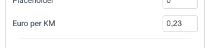

# Costs reimbursement table with 4 columns for Wordpress Elementor Forms

This is a custom build table with 4 columns with entry fields. The number of rows is controlled by a variable in Form control. 
At the moment the limit is set to 7 rows, because the PDF template has a fixed number of rows.

- first column is a date field
- second column is description
- third is mileage 
- fourth is an amount

## Technology background

Implements Custom Field and a new Field Code that addresses array indeces. Most of the code was created with the help of Google Gemini, but some of the suggest ion are different because the standard Elementor documentation is out of date and/or incorrect: 
https://developers.elementor.com/  E.g. the hooks that are suggested to modify the submitted data before it is saved in the submission database, or send by email, are to late in the code (after execution of 'Action After Submit')

### Column 0

Just the row number

### Column 1

A date field. If the date field has a value then the next field is required. 

### Column 2

A text Field

### Column 3, Mileage

A number fields for mileage. This field is multiplied by a Mileage_Ratio, and injected into the 4th column.
The javascript function ```calcKm()``` is executed after every change in column 3.  The Mileage_Ratio is editable in the From Controls.   



If colunm 3 has a value greater then zero, the field in column 4 is made readonly to prevent 
manual override. If the mileage in column 3 is set to zero or removed, then value in column 4 is
removed and the field becomes writeable again. 

After every change of value in column 4, the function ```calculateTotal()``` is triggered.

### Column 4, Total

Any change in the column 4 fields will trigger ```calculateTotal()```. In the Form control can be specified 
in which field the sum needs to be injected. 


The sum field should be a Text input with a label and can be anywhere in your form. The label string is the reference in above Form Control. The Form Field with the sum of column 4 becomes readonly to prevent manual override.

The fields in column 4 have hard coded nl_NL decimal seperator. 
It is also prevented that the last column is not a number.
	

## CalculateTotal()

This is in JavaScript in a seperate file under assets. Some notes: The column 4 fields in the DOM are queried by CSS class. The retionale here is that 'id' and 'name' are not the same while displayed in the Form Builder versus actual deployment.    

```JavaScript
function calculateTotal(evt) {	
    const amountInputs = document.querySelectorAll('.es-input-amount-declaration-field');	
    const totalFieldId  = findTotalFieldId(evt.currentTarget.dataset.total);
    const totalField  = document.getElementById(totalFieldId);
    totalField.readOnly = true;
    let sum = 0;
    
    amountInputs.forEach(input => {
        let val = input.value;
        // Dutch format: remove thousands separator (.), replace decimal comma (,) with dot (.)
        val = val.replace(/\./g, '').replace(',', '.');
        const numberValue = parseFloat(val);
        if (!isNaN(numberValue)) { sum += numberValue; }
    });
    totalField.value = dutchFormatter.format(sum);
}
```

## CalcKM()

Also a Javscript asset. Same story here: form input fields are looked up by CSS class name.

```JavaScript
function calcKm(evt) {
    const ratio = evt.currentTarget.dataset.mileageratio;
    const kmInputs = document.querySelectorAll('.es-input-km-declaration-field');
	const amountOutputs = document.querySelectorAll('.es-input-amount-declaration-field');

    kmInputs.forEach((element, index ) => {
        calAndMap(element, ratio, amountOutputs[index]);
    });
}
```

## Mapping Rows and Columns in Email and PDF templates.

Many actions after form submit require all fields be one dimensional (can not handle Arrays). The standard ```[field id="your_id"]``` will show concatenated array fields in a string seperated by commas. In order to access the individual array elements in a fieldcode, we introduce a new fieldcode type: ```[array_index id="your_id" index="3"]```.   

See below 2 code snippets that introduce a new Field Code type. The First snippet captures the Form $record into a global variable because we need the Record while processing the field codes. The second snippet handles the field code when found in an action.

```php
// Step 1: Capture Elementor Form submission data globally
// This hook ensures our shortcode can access the form data during email processing.
add_action('elementor_pro/forms/record/actions_before', function($record, $handler) {
    // Store formatted data (often comma-separated for multi-selects)
    $GLOBALS['elementor_form_submission_data'] = $record->get('fields');

	return $record;
}, 10, 2);
```

```php
// Step 2: Custom Shortcode to handle array fields by index or loop
function elementor_form_indexed_array_field_shortcode($atts) {
    $atts = shortcode_atts(
        array(
            'id' => '',          // The Field ID from Elementor (e.g., "my_checkbox_field")
            'index' => null,     // Specific index (0-based) to retrieve. If null, loops through all.
            'tag' => 'li',       // HTML tag for each item when looping (e.g., 'li', 'p', 'span')
            'wrapper_tag' => 'ul', // HTML wrapper tag when looping (e.g., 'ul', 'ol', 'div')
            'separator' => '',   // Separator for items when looping and no tags are used (e.g., ', ' or '<br>')
            'display_empty' => 'false', // 'true' to show wrapper even if no values when looping
            'fallback' => 'not found',    // Text to display if the index is not found or no values
        ),
        $atts,
        'array_index'
    );

    $field_id = $atts['id'];
	
    $requested_index = (isset($atts['index']) && is_numeric($atts['index'])) ? (int)$atts['index'] : null;
    $output = '';

    // Ensure we have submission data
    if (!isset($GLOBALS['elementor_form_submission_data'])) {
        return $atts['fallback']; // No submission data available
    }

    $submission_data = $GLOBALS['elementor_form_submission_data'];
	
    // Check if the specific field exists in the submission
    if (!isset($submission_data[$field_id])) {
        return $atts['fallback']; // Field not found in submission
    }

    $field_value_array = $submission_data[$field_id];
	
	$values = $field_value_array['raw_value'];
	// Check if the field value is an Array
	if (!is_array($field_value_array)) {
		 return $atts['fallback']; // Field not found in submission
	}

    // --- Handle retrieval by index ---
    if ($requested_index !== null) {
        if (isset($values[$requested_index])) {
            $output = esc_html($values[$requested_index]);
        } else {
            $output = $atts['fallback']; // Index not found
        }
    }
    // --- Handle looping through all values ---
    else {
        if (!empty($values) || $atts['display_empty'] === 'true') {
            if (!empty($atts['wrapper_tag'])) {
                $output .= '<' . esc_attr($atts['wrapper_tag']) . '>';
            }

            foreach ($values as $value) {
                if (!empty($atts['tag'])) {
                    $output .= '<' . esc_attr($atts['tag']) . '>' . esc_html($value) . '</' . esc_attr($atts['tag']) . '>';
                } else {
                    $output .= esc_html($value) . $atts['separator'];
                }
            }

            if (!empty($atts['wrapper_tag'])) {
                $output .= '</' . esc_attr($atts['wrapper_tag']) . '>';
            } else if (!empty($atts['separator'])) {
                // Remove trailing separator if no wrapper tag
                $output = rtrim($output, $atts['separator']);
            }
        } else {
             $output = $atts['fallback']; // No values to loop and not displaying empty
        }
    }

    return $output;
}
add_shortcode('array_index', 'elementor_form_indexed_array_field_shortcode');

// Step 3: Clean up the global variable after mail is sent
//         Or after the last Action executed in your workflow
//         In our case we use E2PDF which is fired from mail via [e2pdf-attachment id="9"]
add_action('elementor_pro/forms/send_mail', function() {
    if (isset($GLOBALS['elementor_form_submission_data'])) {
        unset($GLOBALS['elementor_form_submission_data']);
    }
});
```
